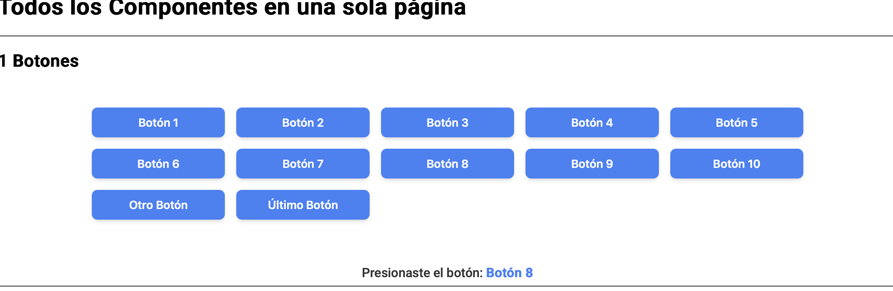
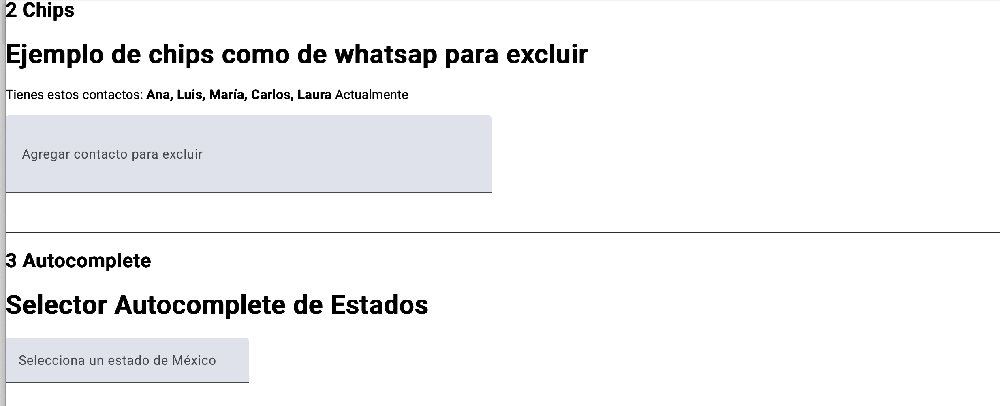
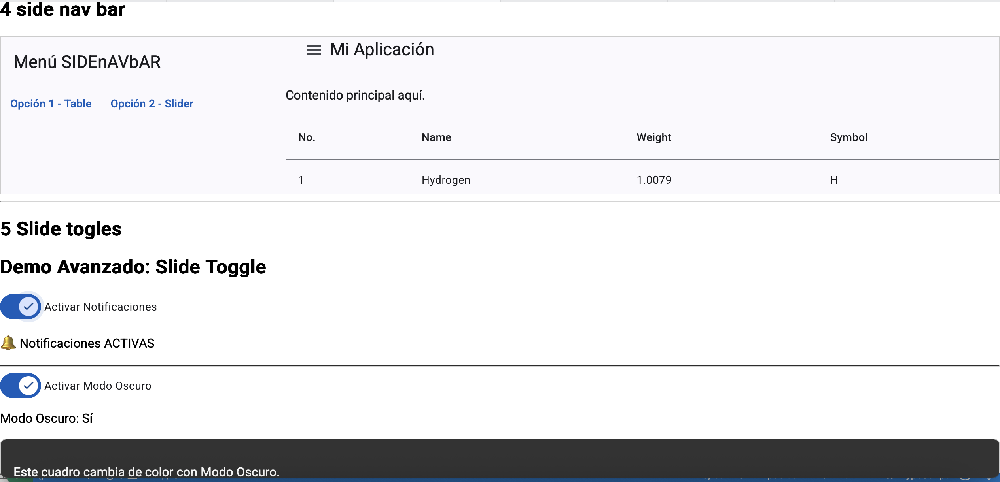
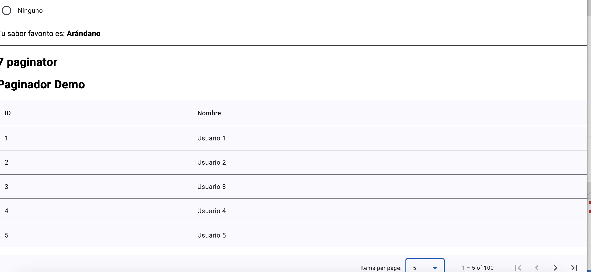
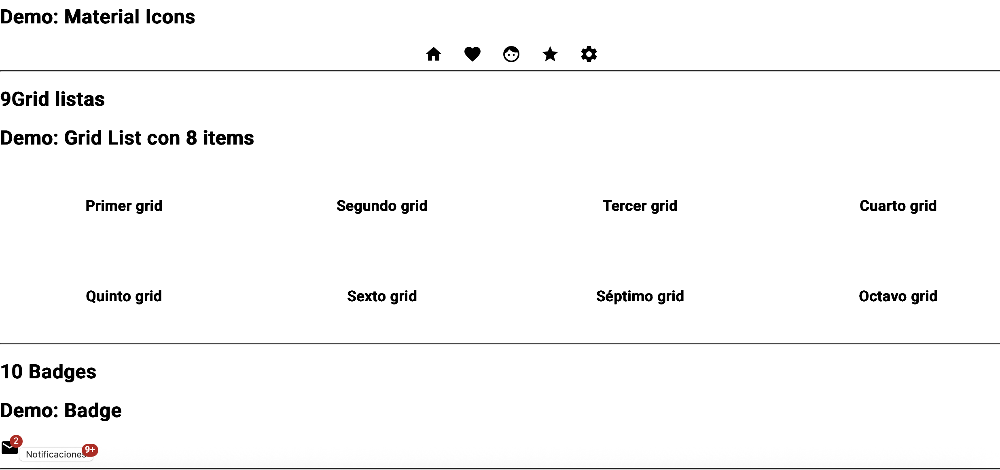
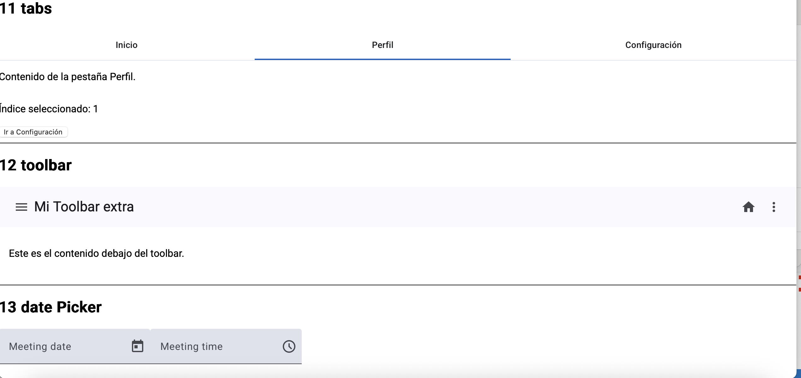
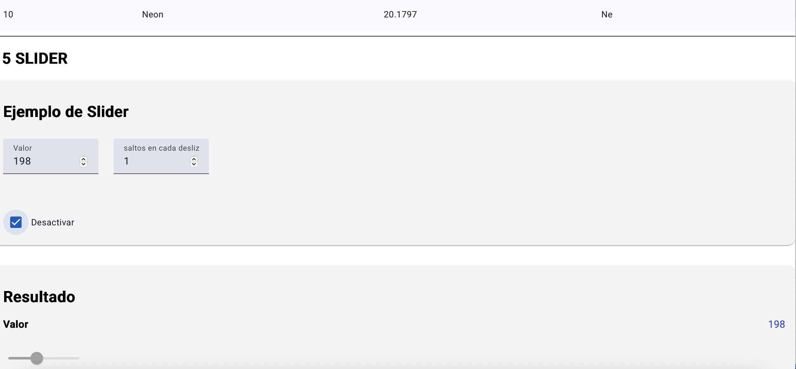
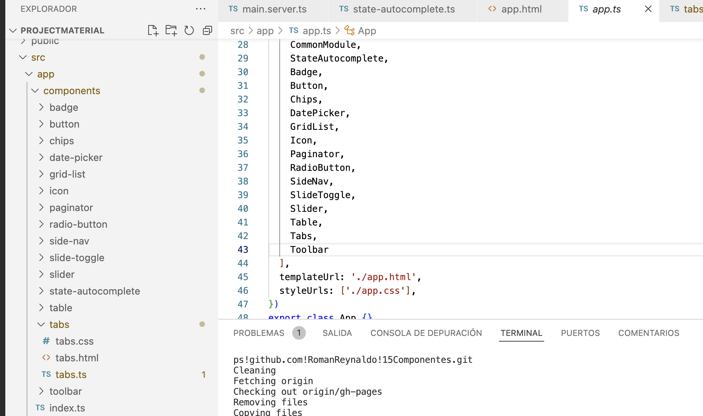

# 15Componentes - Angular

Este proyecto es una aplicación Angular desarrollada como parte de una práctica para aprender y demostrar el uso de **15 componentes personalizados** en Angular. Cada componente realiza una función específica de forma modular.

🔗 **Demo en línea**:  
[https://romanreynaldo.github.io/15Componentes/button](https://romanreynaldo.github.io/15Componentes/button)

📸 Capturas de Pantalla
<div align="center">  
   
  <br>
  
  
  <br> 
  
  
  <br> 
   
   
</div>
## 📦 Características

- Proyecto desarrollado con Angular CLI
- 15 componentes personalizados
- Uso de `@Input()` y `@Output()` para comunicación entre componentes
- Estilos modulares
- Despliegue en GitHub Pages

## 🧱 Estructura del proyecto


## 🚀 Instalación

1. Clona el repositorio:

   ```bash
   git clone https://github.com/RomanReynaldo/15Componentes.git
   cd 15Componentes
   
ng build --base-href=https://romanreynaldo.github.io/15Componentes/
npx angular-cli-ghpages --dir=dist/15Componentes

## 🛠️ Requisitos

Node.js
Angular CLI
npm

## 📄 Licencia

Este proyecto se puede utilizar para fines académicos.

## Contacto 
Reynaldo Roman Mendoza

rreynaldoromanm@gmail.com

